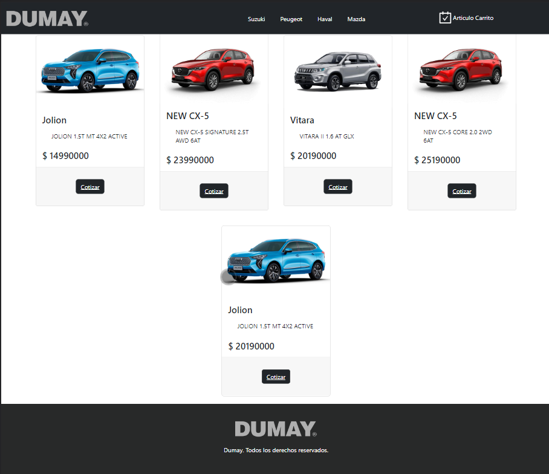

# E-commerce  Proyecto React

Este proyecto, ha sido generado para el curso de react, el cual se crea un e-commerce de Autos con diferentes imagenes

# React Librerias utilizadas
- [react-router-dom] (https://reactrouter.com/en/main) : React Router DOM es un paquete que me permitio implementar enrutamiento dinámico en la aplicación web. Me permite mostrar páginas y permitir que los usuarios naveguen por ellas.
- [react-spinners]:  Cada loading tiene sus propias propiedades predeterminadas. lo utilice en el home de inicio  
- [react-loading-skeleton]: Cada loading de skeleton, lo use en las cargas del cart, al agregar al carro, entre otros  
- [Firebase]: Firebase es una plataforma de desarrollo de apps que te ayuda a compilar y desarrollar las apps, principalmente fue utilizada para almacenar los productos, y almacenamiento de datos como  Ordenes de seguimiento (cliente, nombre, apellido, direccion mail, etc.)
- [react-icons]: libreria para extraer iconos, en donde fueron agregados como el cart en el navbar principal.
- [bootstrap] : Libreria utilizada para 

## Funcionalidades del proyecto

En el directorio del proyecto, puede ejecutar:
- Agregar un producto a un carrito
- Sumar o restar cantidad en base al stock del producto.
- Eliminar un producto seleccinado del carrito.
- Ingresar datos mediante un formulario.
- genera una ID para Orden de seguimiento.

### `npm start`

Ejecuta la aplicación en el modo de desarrollo.\
Abra [http://localhost:3000](http://localhost:3000) para verlo en su navegador.

The page will reload when you make changes.\
You may also see any lint errors in the console.

### Flujo del usuario

1.-Selecciona una unidad disponible en el e-commerce.

2.- al seleccionar lista el detalle del producto, en donde el usuario podra sumar o restar cantidad a comprar, si esta de acuerdo podra agregar al carrito.

3.- Al agregar al carrito, el sitio listara cada registro. Aqui el usuario podra eliminar si no desea el producto, vaciar el carrito completo o simplemente terminar el proceso para poder enviar sus datos dentro del checkout

4.- El usuario podra ingresar sus datos, para poder generar una orden de seguimiento

### Deployment

